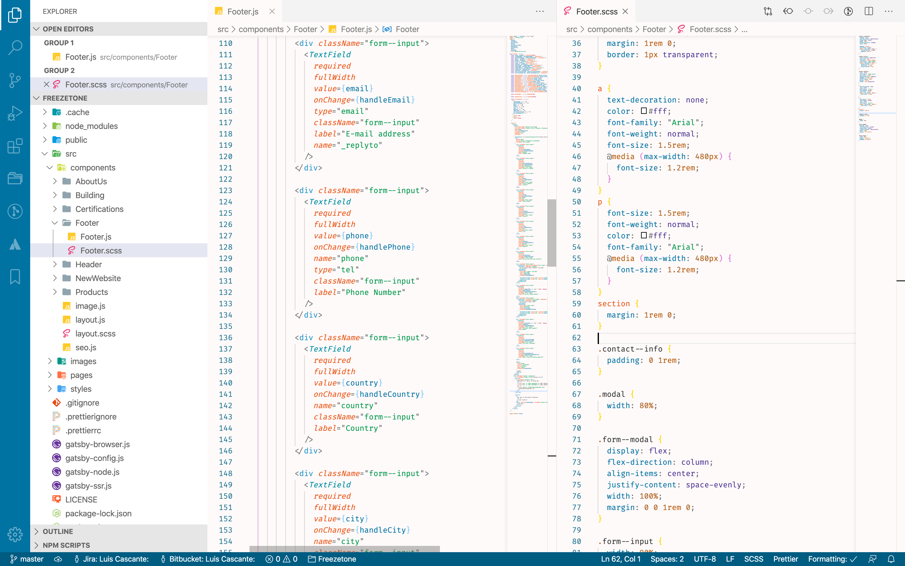
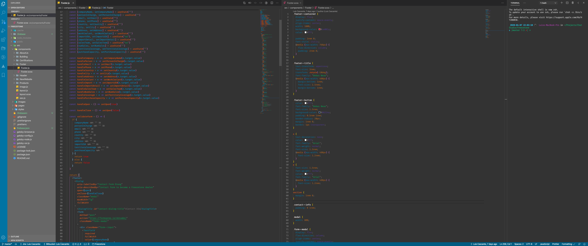

# Benders Theme

---

Based on the colors from the 4 nations of Avatar: The Last Airbender, with contrast ratio modifications. Most colors have a ratio of 4:5+, but all of them are about 3:5. It aims to be readable and easy on the eyes.

Ratings, reviews and feedback are always welcome.

Contributions, bug reports, requests, [here](https://github.com/luis-whitelotus/avatar-theme).
